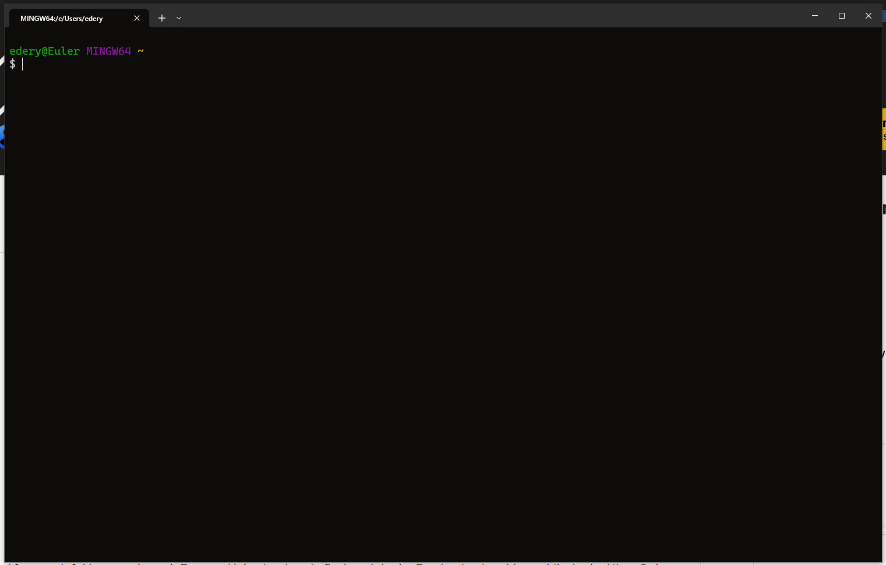
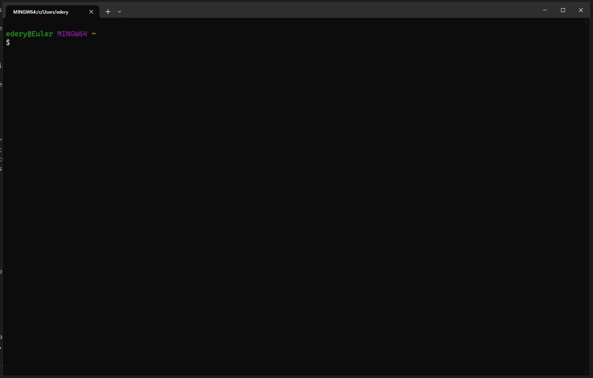
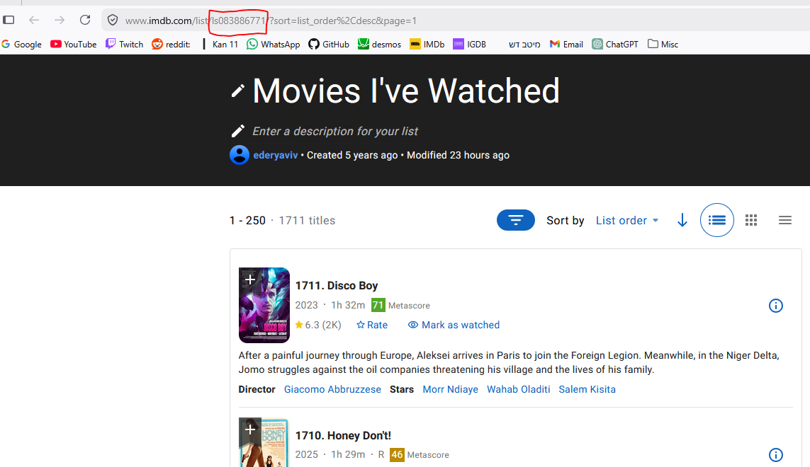

Introduction
============

FilmFlam (or just "flam") is a commandline tool and API for extracting insights from your movie lists.

From the commandline, flam enables you to quickly answer questions like "where have I seen this actor?", or "which director have I seen the most movies from?", and so much more.

For more powerful uses, you can ``import flam`` and use the underlying API to access all the data about the movies and people in your movie lists.

Features
--------

* Get **information** about all the movies in your movie list, or about the people in those movies
* **Filter** those movies or people to find something specific
* **Sort** everything and everyone and discover standouts
* **Extend** flam to support custom movie databases, custom filters, and custom attributes
* All in a short and quick commandline
* All in a python API for using from a script

Installation
------------

Simply:

.. code-block:: bash

    pip install film-flam

And you should be good to go!

Basic usage
-----------

.. warning::

    This tutorial assumes your list is on **IMDb** and is **public**.
    If that is not the case, read the :ref:`full list of supported fetchers <List of builtin fetchers>` and pick the one that's right for you.

The first thing you need to do is **let flam know which movie list you want to use**. For IMDb lists, it's easy to find the list ID from the URL on the list page:

So in this case the list ID is 083886771. Let's configure it:

.. code-block:: bash

    flam config list watched imdb-browser-apidev-listid=083886771
    
Now flam will know this list by the name "watched", and it knows that this list can be downloaded using the "fetcher" imdb-browser-apidev-listid.

.. tip::

    :ref:`Fetchers` tell flam how to download a list - different fetchers may download from different sites (IMDb, Letterboxd, etc.),
    or in different ways (the official IMDb API, or some unofficial one, etc.).

Next, assuming your list is configured, we can **fetch all its data**. Run:

.. code-block:: bash

    flam fetch watched

This will automatically open your browser and click some buttons to export the IMDb list to CSV, so don't be alarmed by that.
Fetching can be quick or it may take several hours, depending on the size of your list. It's safe to interrupt this in the middle. Once it's done, you're ready to **start using flam!**

.. code-block:: bash

    # Browse all movies in the list.
    flam find movies watched
    
    # Find directors named "tarantino" including all their movies from the list.
    flam find director watched -name tarantino
    
    # Find people from any movie in the list whose average rating across those movies is at least 8.
    flam find people watched -avg-rating +8

What's next
-----------

* Configure your lists with ``--default-fetch=yes``, ``--default-find=yes`` so you don't need to type their name every time
* Re-run ``flam fetch`` whenever you want to refresh the database after adding movies to your list
* Flam supports finding **movies**, **people**, or **roles**. Read all about :ref:`what they mean <Findables>`
* Read about :ref:`filters <Filters>` for composing more complex queries. Any random question you can think of, flam can answer!\*
* Read more about :ref:`how to configure lists <Lists>` and configure flam with all your movie lists!
* Read the :ref:`API docs <API>` if you're interested in using flam from a python script

\* Probably :)

Supported platforms
-------------------

Flam is written to be cross-platform so it should work on both Windows and Linux. However since I am using Windows, I never tested it on Linux. Please let me know if you encounter issues on Linux.

Flam is better if you have ``less`` installed. If you're on Windows, it's recommended to install it. One easy way is to just install `git <https://git-scm.com/>`__.

Getting help
------------

If you encounter issues or have questions, you can `open a GitHub issue <https://github.com/Verpous/film-flam/issues>`__, or email me at ederyaviv2@gmail.com.
